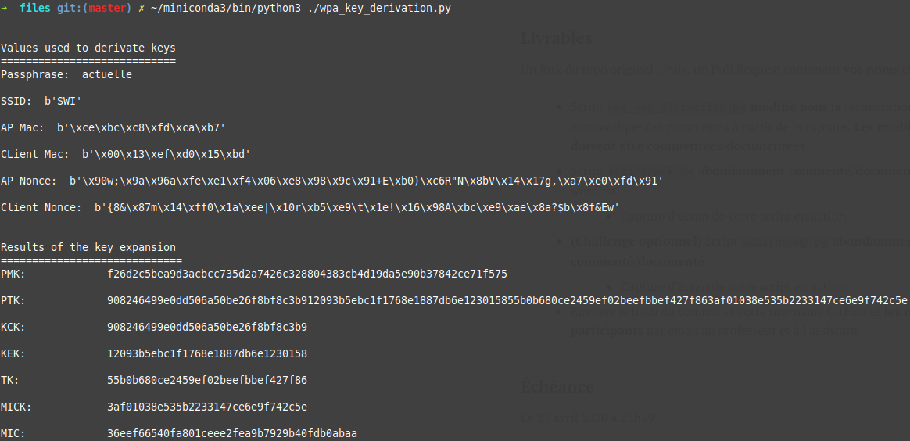

- [Livrables](https://github.com/arubinst/HEIGVD-SWI-Labo3-WPA#livrables)

- [Échéance](https://github.com/arubinst/HEIGVD-SWI-Labo3-WPA#échéance)

- [Travail à réaliser](https://github.com/arubinst/HEIGVD-SWI-Labo3-WPA#travail-à-réaliser)

# Sécurité des réseaux sans fil

## Laboratoire 802.11 Sécurité WPA

__A faire en équipes de deux personnes__

__Développement à faire en Python 3__

**Étudiants:** Nathanaël Mizutani, Stefan Dejanovic

### Pour cette partie pratique, vous devez être capable de :

* Extraire à partir d’une capture Wireshark les données nécessaires pour dériver les clés de chiffrement et intégrité WPA utilisant Scapy
* Coder votre propre version du logiciel ```aircrack``` pour trouver la passphrase d’un réseau WPA à partir d’une capture utilisant Python et Scapy
* (Challenge) Coder votre propre version des outils ```airodump``` et ```aireplay``` pour déauthentifier un client, sniffer un handshake et l’utiliser pour trouver une passphrase WPA utilisant Python et Scapy


__Il est fortement conseillé d'employer une distribution Kali__ (on ne pourra pas assurer le support avec d'autres distributions). __Si vous utilisez une VM, il vous faudra une interface WiFi usb, disponible sur demande__.

__ATTENTION :__ Pour l'exercise "challenge", il est très important de bien fixer le canal lors de vos captures et vos injections. Si vous en avez besoin, la méthode la plus sure est d'utiliser l'option :

```--channel``` de ```airodump-ng```

et de garder la fenêtre d'airodump ouverte en permanence pendant que vos scripts tournent ou vos manipulations sont effectuées.


## Travail à réaliser

### 1. Obtention des paramètres pour la dérivation des clés WPA  

Dans cette première partie, vous allez récupérer le script **Python3** [wpa_key_derivation.py](https://github.com/arubinst/HEIGVD-SWI-Labo3-WPA/blob/master/files/). Il vous faudra également le fichier de capture [wpa_handshake.cap](https://github.com/arubinst/HEIGVD-SWI-Labo3-WPA/blob/master/files/) contenant un processus d’authentification WPA. Vous aurez aussi besoin du fichier [pbkdf2.py](https://github.com/arubinst/HEIGVD-SWI-Labo3-WPA/blob/master/files/), qui permet de calculer les 4096 tours pour le hash de la passphrase. Tous ces fichiers doivent être copiés dans le même répertoire local sur vos machines.

- Ouvrir le fichier de capture [wpa_key_derivation.py](https://github.com/arubinst/HEIGVD-SWI-Labo3-WPA/blob/master/files/) avec Wireshark
- Exécuter le script avec ```python3 wpa_key_derivation.py```
- Essayer d’identifier les valeurs affichées par le script dans la capture Wireshark
- Analyser le fonctionnement du script. En particulier, __faire attention__ à la variable ```data``` qui contient la payload de la trame et la comparer aux données de la quatrième trame du 4-way handshake. Lire [la fin de ce document] pour l’explication de la différence.
- __Modifier le script__ pour qu’il récupère automatiquement, à partir de la capture, les valeurs qui se trouvent actuellement codées en dur (```ssid```, ```APmac```, ```Clientmac```, nonces…) 

**Remarque :** Dans le screenshot, on peut trouver toutes les informations tells que le ssid, APmac, Clientmac etc...



### 2. Scaircrack (aircrack basé sur Scapy)

Aircrack utilise le quatrième message du 4-way handshake pour tester les passphrases contenues dans un dictionnaire. Ce message ne contient pas de données chiffrées mais il est authentifié avec un MIC qui peut être exploité comme « oracle » pour tester des clés différentes obtenues des passphrases du dictionnaire.


Utilisant le script [wpa_key_derivation.py](https://github.com/arubinst/HEIGVD-SWI-Labo3-WPA/blob/master/files/) comme guide, créer un nouveau script scaircrack.py qui doit être capable de :

- Lire une passphrase à partir d’un fichier (wordlist)
- Dériver les clés à partir de la passphrase que vous venez de lire et des autres éléments nécessaires contenus dans la capture (cf [exercice 1](https://github.com/arubinst/HEIGVD-SWI-Labo3-WPA#1-obtention-des-paramètres-pour-la-dérivation-des-clés-wpa))
- Récupérer le MIC du dernier message du 4-way handshake dans la capture
- Avec les clés dérivées à partir de la passphrase, nonces, etc., calculer le MIC du dernier message du 4-way handshake à l’aide de l’algorithme Michael (cf l’explication à la fin de ce document)
- Comparer les deux MIC
   - Identiques &rarr; La passphrase utilisée est correcte
   - Différents &rarr; Essayer avec une nouvelle passphrase

**Remarque:** sur ce screenshot on peut remarquer que dans un cas nous avons le bon passphrase et dans l'autre un mauvais.


### 3. Scairodump (Challenge)

**Note : un délai supplémentaire peut être accordé pour ce dernier exercice - contactez-nous si jamais. Le reste du labo est à rendre à la date indiquée**

Modifier votre script de cracking pour qu’il soit capable de faire les mêmes opérations que le script précédant mais sans utiliser une capture Wireshark. Pour cela, il faudra donc sniffer un 4-way handshake utilisant Scapy et refaire toutes les opérations de la partie 2 pour obtenir la passphrase. Le script doit implémenter la possibilité de déauthentifier un client pour stimuler le 4-way handshake. Cette déauthentification doit aussi être implémentée avec Scapy.

**Remarque:** On a essayé d'effectuer le challenge mais nous n'avons pas reussi à le faire fonctionner car les paquets doivent arriver dans le bon ordre et en même temps pour faire fonctionner le script

## Quelques éléments à considérer :

- Le dernier message du 4-way handshake contient un MIC dans sa payload. Pour calculer vous-même votre MIC, vous devez mettre les octets du MIC dans cette payload à ```\x00```
- Le calcul du MIC peut utiliser MD5 (WPA) ou SHA-1 (WPA2). Le 4-way handshake contient les informations nécessaires dans le champ Key Information

## Livrables

Un fork du repo original . Puis, un Pull Request contenant **vos noms** et :

- Script ```wpa_key_derivation.py``` **modifié pour** la récupération automatique des paramètres à partir de la capture. **Les modifications doivent être commentées/documentées**
- Script ```scaircrack.py``` **abondamment commenté/documenté** + fichier wordlist
   - Capture d’écran de votre script en action
-	**(Challenge optionnel)** Script ```scairodump.py``` **abondamment commenté/documenté** 
   - Capture d’écran de votre script en action
-	Envoyer le hash du commit et votre username GitHub et **les noms des participants** par email au professeur et à l'assistant


## Échéance

Le 27 avril 2020 à 23h59
